# Implementing CI/CD pipeline for Terraform using Jenkins
CI?CD pipeline for terraform helps automate the process of building, testing, and deploying changes to infrastructure. It makes everything faster, more reliable, and consistent across different environments. We will use Jenkins along with Terraform, which lets us write code to define our infrastructure. This setup helps us make sure that our infrastructure can be easily reproduced and scaled up as needed. Jenkins helps with collaborative development, visibility, and continuous integration and deployment. By using this setup, we can get our terraform  to market faster, save resources, optimize costs, and make sure we're meeting security standards. Overall, it helps organizations adapt quickly to changing needs in software development and operations.
## Setting Up the Environment
To get started, we'll set up a Jenkins server running in a Docker container. We'll create a Dockerfile to define how our Jenkins server should be configured. This file will include all the things Jenkins needs to run smoothly, as well as the Terraform CLI. While Jenkins provides a Docker image that works out of the box, we need to tweak it a bit to make sure it can also run Terraform.

## Creating a Dockerfile for Jenkins
Jenkins provides a Docker image that includes all the necessary dependencies to run a container out of the box. However, since we have a unique requirement to run Terraform, we need to extend this image to accommodate our needs.

You can find the official Jenkins Docker image [here](https://hub.docker.com/r/jenkins/jenkins)
 The first step is to create a directory and inside the directory create a file named "Dockerfile" 
 We will use the Dockerfile to define the configuration for our jenkins server and include any dependencies required to run Terraform seamlessly. 
content added to the dockerfile
```bash
 # Use the official Jenkins base image
 FROM jenkins/jenkins:lts

 # Switch to the root user to install additional packages
 USER root

 # Install necessary tools and dependencies (e.g., Git, unzip, wget, software-properties-common)
 RUN apt-get update && apt-get install -y \
     git \
     unzip \
     wget \
     software-properties-common \
     && rm -rf /var/lib/apt/lists/*

 # Install Terraform
 RUN apt-get update && apt-get install -y gnupg software-properties-common wget \
     && wget -O- https://apt.releases.hashicorp.com/gpg | gpg --dearmor | tee /usr/share/keyrings/hashicorp-archive-keyring.gpg \
     && gpg --no-default-keyring --keyring /usr/share/keyrings/hashicorp-archive-keyring.gpg --fingerprint \
     && echo "deb [signed-by=/usr/share/keyrings/hashicorp-archive-keyring.gpg] https://apt.releases.hashicorp.com $(lsb_release -cs) main" | tee /etc/apt/sources.list.d/hashicorp.list \
     && apt-get update && apt-get install -y terraform \
     && rm -rf /var/lib/apt/lists/*

 # Set the working directory
 WORKDIR /app

 # Print Terraform version to verify installation
 RUN terraform --version

 # Switch back to the Jenkins user
 USER jenkins

```

## Building and running the docker image.

Note: make sure you are inside the folder containing the **Dockerfile**

1. Build the custom jenkins image
```bash
docker build -t jenkins-server .
```

2. Run the image into a docker container
```bash 
docker run -d -p 8080:8080 --name jenkins-server jenkins-server 
```
3. Check the container is running


4. Access the jenkins server from the web browser on **localhost:8080**

5. Access the jenkins server directly inside the container and retrieve the initial jenkins admin password

6. install suggested plugins, create first admin user and access jenkins


# Setting Up Jenkins for Terraform CI/CD
## Jenkins pipelines for terraform

Now, let's dive into setting up a CI/CD pipeline specifically tailored for Terraform. This will streamline infrastructure changes efficiently. Here are the key benefits: 
Automated infrastructure deployment
Fast feedback Loop
Continuous testing
Enhanced Collaboration and Productivity: Facilitate teamwork among team members.
Accelerated release cycle
Risk Reduction: Minimize risks in production environments.
## Set up Git repository with Terraform code

To do this project, you need existing terraform codem if you dont have one, you can use the code from this Github repo [here](https://github.com/babslekson/terraform-cloud.git) - It provisions cloud solution for 2 company websites.

Note: Make sure you update the backend configuration

## Connect Github repo to Jenkins
1. install jenkins Github plugins
2. To ensure seemless and efficient pipelone within jenkins install terraform plugins and AWS Credentials plugins. ( Note: i am using AWS as my provider)
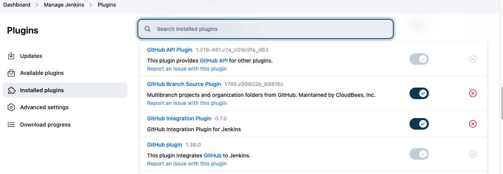

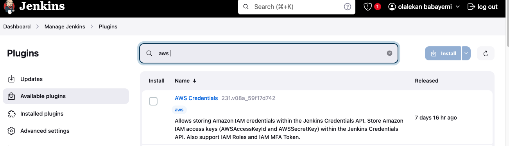

# Configure Github Credentials in Jenkins
To enable Jenkins to access GitHub repositories, we need to store GitHub credentials in Jenkins. This allows Jenkins to authenticate and interact with GitHub repositories, even if they are private. 
1. Generate access token from github and save in a notepad for use later

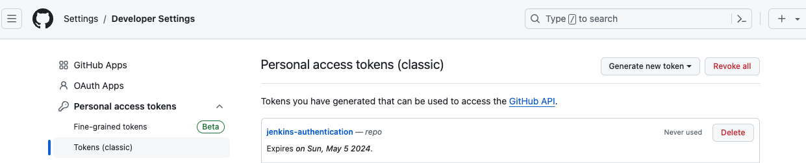

2. In Jenkins, navigate to "Manage Jenkins" -> Click on "Credentials". click on the arrow next to global and select "add credentials".  Add your credentials (username, password and the access token generated earlier)

3. Create a second  credentials for AWS secret and access key
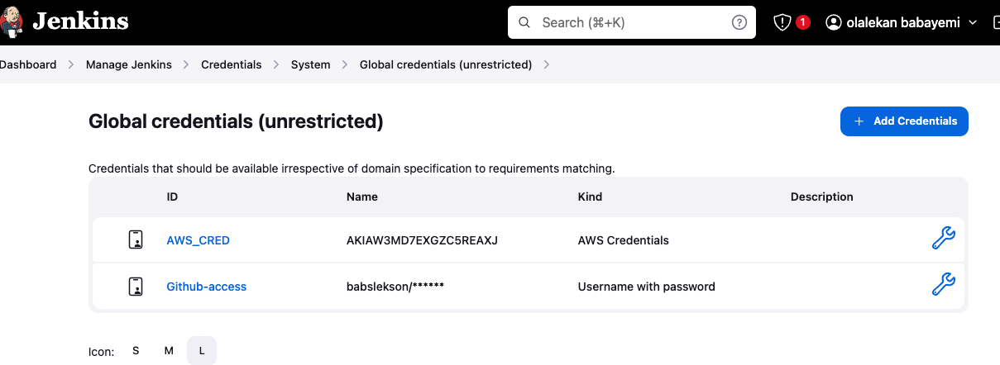
4. Set Up a Jenkins Multibranch pipeline, select type of source of the code (github), add the repo url, jenkinsfile and click on save. (Note: I already have the jenkins pipeline configuration file in my repo which will be explained later on in this documentation)
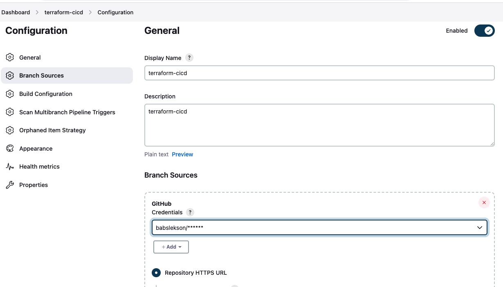
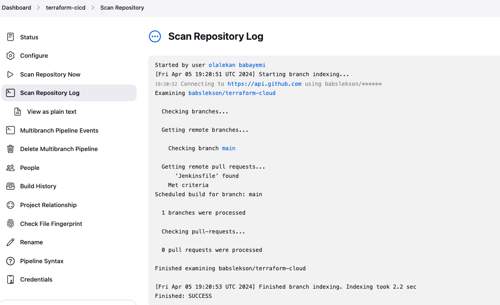 
5. Build project and check the console output
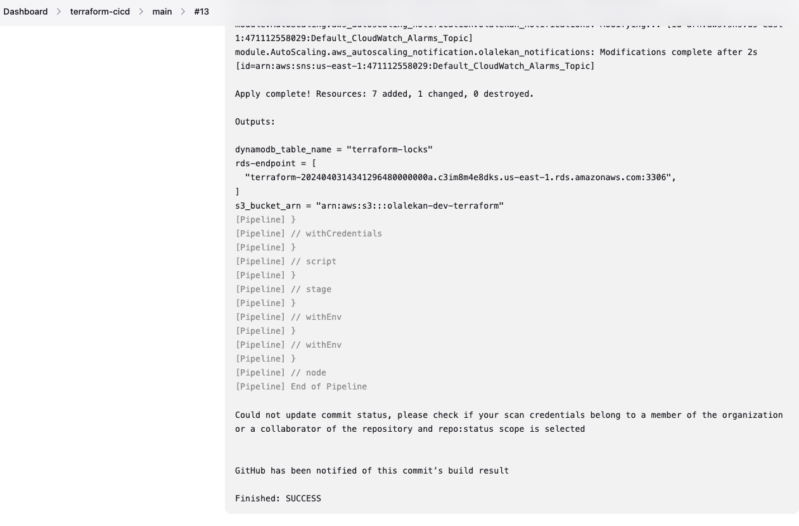
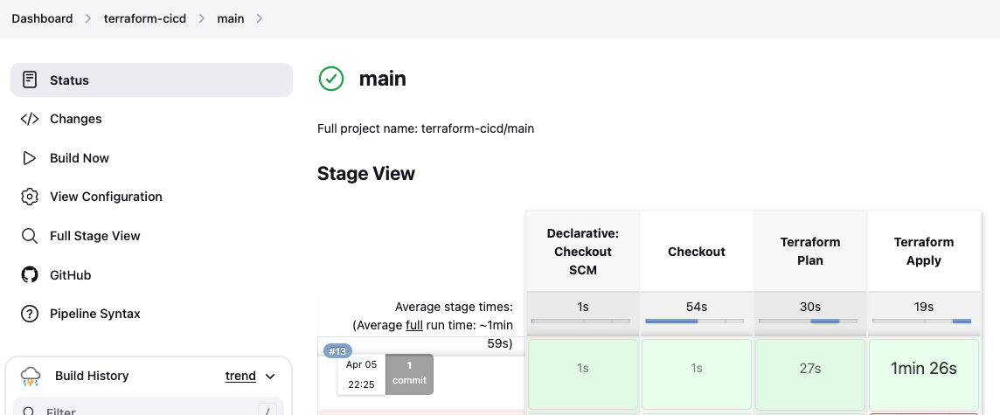

## Jenkinsfile
The Jenkinsfile acts as a smart guide, taking care of tasks, automating the process of code checkout and handling infrastructure updates through Terraform. It ensures that we follow a clear process for reviewing and implementing these changes. For critical environments such as production, it adds an extra layer of safety by prompting for manual confirmation before making any significant alterations.
### Content of Jenkinsfile
```bash
pipeline {
    agent any

    environment {
        TF_CLI_ARGS = '-no-color'
    }

    stages {
        stage('Checkout') {
            steps {
                script {
                    checkout scm
                }
            }
        }

        stage('Terraform Plan') {
            steps {
                script {
                    withCredentials([aws(credentialsId: 'AWS_CRED', accessKeyVariable: 'AWS_ACCESS_KEY_ID', secretKeyVariable: 'AWS_SECRET_ACCESS_KEY')]) {
                        echo "Initializing Terraform..."
                        sh 'terraform init'
                        echo "Generating terraform plan"
                        sh 'terraform plan -out=tfplan'
                    }
                }
            }
        }

        stage('Terraform Apply') {
            when {
                expression { env.BRANCH_NAME == 'main' && currentBuild.rawBuild.getCause(hudson.model.Cause$UserIdCause) != null }
            }
            steps {
                script {
        //             // Ask for manual confirmation before applying changes
                     input message: 'Do you want to apply changes?', ok: 'Yes'
                     echo " Applying Terraform changes"
                    withCredentials([aws(credentialsId: 'AWS_CRED', accessKeyVariable: 'AWS_ACCESS_KEY_ID', secretKeyVariable: 'AWS_SECRET_ACCESS_KEY')]) {

                
                        sh 'terraform apply tfplan'
                    }
                }
            }
        }
    }
}
```
Here is a brief explanation of each stage 
Checkout: This stage retrieves the source code from the repository.
Terraform Plan: It initializes Terraform and generates a plan for infrastructure changes.
Terraform Apply: This stage applies the Terraform changes. It's triggered only for the 'main' branch and requires manual confirmation before applying changes.
Overall, this pipeline ensures a systematic approach to managing infrastructure changes while adding an extra layer of safety for critical environments.

## Enhancing and extending the pipeline

In addition to enhancing the existing pipeline, we will create a new branch to showcase Jenkins' capabilities. If the pipeline for the new branch fails, it will prevent the creation of resources, demonstrating the power of Jenkins in ensuring the stability and reliability of our infrastructure. The updated pipeline script will include additional stages to introduce new functionality, improve code clarity, and adhere to best practices in CI/CD pipelines

1. new branch named **enhance-terraform-apply** was created.
2. enhance the pipeline by adding logging to track the progress of the pipeline within both terraform plan & apply
3.  introduced a new stage in the pipeline script called 'Lint Code' which precedes the 'Terraform Plan' stage. This stage validates the syntax, consistency, and correctness of Terraform configuration files within the directory where it is executed. It specifically employs the 'terraform validate' command for this purpose. Notably, this stage does not involve accessing any remote services.
4. Incorporated into the pipeline script is a final stage called 'Cleanup', which executes irrespective of the success or failure of preceding stages. Additionally, error handling has been implemented throughout the script to gracefully manage failures. Furthermore, comments have been strategically added to the pipeline script, providing clarity on each stage's purpose and elucidating important commands used. This enhances the maintainability and comprehensibility of the pipeline.

```bash

pipeline {
    agent any  // Defines that this pipeline can run on any available agent

    environment {
        TF_CLI_ARGS = '-no-color' // Sets Terraform CLI arguments to disable color output
    }

    stages {
        stage('Checkout') {
            steps {
                script {
                    // Checkout the source code from the repository
                    checkout scm
                }
            }
        }
        stage('Lint Code') {
            steps {
                script {
                    withCredentials([aws(credentialsId: 'AWS_CRED', accessKeyVariable: 'AWS_ACCESS_KEY_ID', secretKeyVariable: 'AWS_SECRET_ACCESS_KEY')]) {
                         // Validate the syntax, consistency, and correctness of Terraform configuration files
                        echo "Validating Terraform configuration..."
                        sh 'terraform init'
                        sh 'terraform validate' 
                        echo "Terraform code linting completed"
                    }
                }
            }
        }

        stage('Terraform Plan') {
            steps {
                script {
                    withCredentials([aws(credentialsId: 'AWS_CRED', accessKeyVariable: 'AWS_ACCESS_KEY_ID', secretKeyVariable: 'AWS_SECRET_ACCESS_KEY')]) {
                        echo "Initializing Terraform..."
                        sh 'terraform init'
                        echo "Generating terraform plan"
                        sh 'terraform plan -out=tfplan'
                    }
                }
            }
        }

        stage('Terraform Apply') {
            when {
                expression { env.BRANCH_NAME == 'main' && currentBuild.rawBuild.getCause(hudson.model.Cause$UserIdCause) != null }
            }
            steps {
                script {
                 // Automatic confirmation 
                    
                     echo " Applying Terraform changes"
                    withCredentials([aws(credentialsId: 'AWS_CRED', accessKeyVariable: 'AWS_ACCESS_KEY_ID', secretKeyVariable: 'AWS_SECRET_ACCESS_KEY')]) {

                
                        sh 'terraform apply -auto-approve'
                    }
                }
            }

            post {
                success {
                    // If Terraform apply succeeds, perform cleanup
                    cleanup()
                }
                failure {
                    // If Terraform apply fails, handle the error gracefully
                    echo 'Terraform apply failed. Sending notification...'
                    // Add code to send notification or log detailed error messages
                    cleanup()
                }
            }
        }
        

        stage('Cleanup') {
            steps {
                script {
                    // Clean up any temporary files or state
                    echo 'Cleaning up...'
                    // Add commands to clean up any temporary files or state
                }
            }
        }
    }
}

```

Push all changes to the branch.

Navigate to jenkins to see if new branch pipeline has been build.
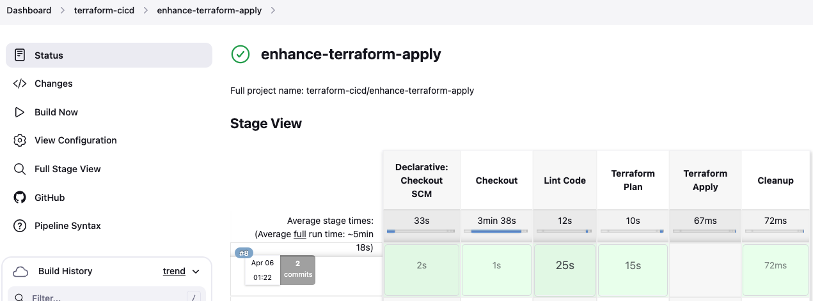
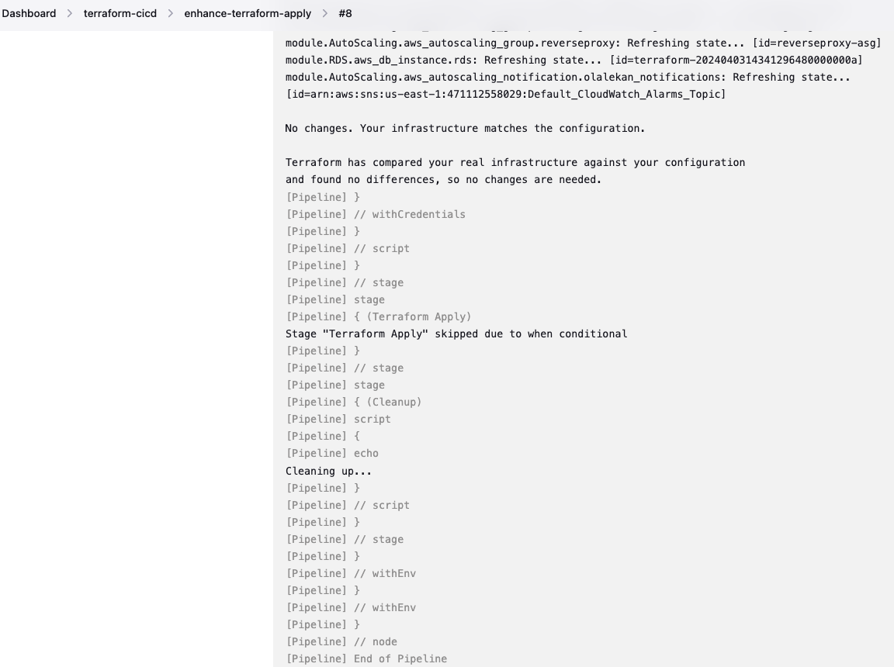
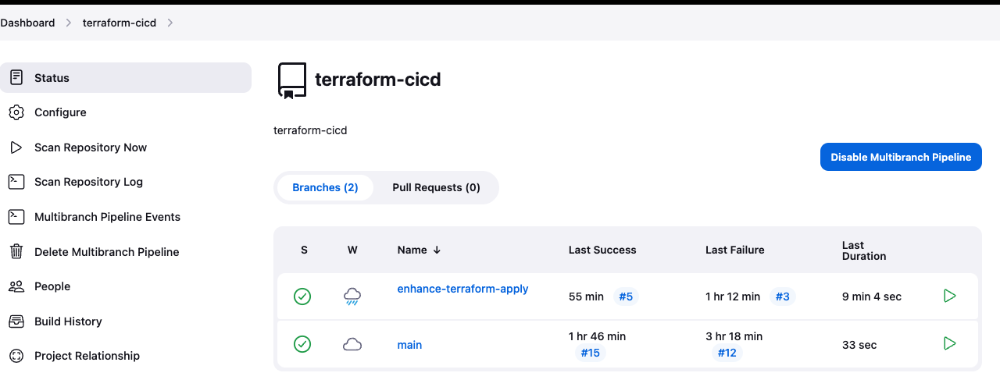 

 END
