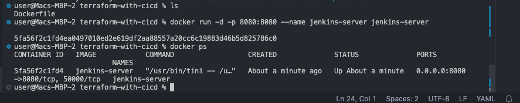

# Implementing CI/CD pipeline for Terraform using Jenkins
This project is all about creating a CI/CD pipeline for Terraform projects. This pipeline helps automate the process of building, testing, and deploying changes to infrastructure. It makes everything faster, more reliable, and consistent across different environments. We use a tool called Jenkins along with Terraform, which lets us write code to define our infrastructure. This setup helps us make sure that our infrastructure can be easily reproduced and scaled up as needed. Jenkins helps with collaborative development, visibility, and continuous integration and deployment. By using this setup, we can get our projects to market faster, save resources, optimize costs, and make sure we're meeting security standards. Overall, it helps organizations adapt quickly to changing needs in software development and operations.
## Setting Up the Environment
To get started, we'll set up a Jenkins server running in a Docker container. We'll create a Dockerfile to define how our Jenkins server should be configured. This file will include all the things Jenkins needs to run smoothly, as well as the Terraform CLI. While Jenkins provides a Docker image that works out of the box, we need to tweak it a bit to make sure it can also run Terraform.

## Creating a Dockerfile for Jenkins
Jenkins provides a Docker image that includes all the necessary dependencies to run a container out of the box. However, since we have a unique requirement to run Terraform, we need to extend this image to accommodate our needs.

You can find the official Jenkins Docker image [here](https://hub.docker.com/r/jenkins/jenkins)
 The first step is to create a directory and inside the directory create a file named "Dockerfile" 
 We will use the Dockerfile to define the configuration for our jenkins server and include any dependencies required to run Terraform seamlessly. 
content added to the dockerfile
```bash
 # Use the official Jenkins base image
 FROM jenkins/jenkins:lts

 # Switch to the root user to install additional packages
 USER root

 # Install necessary tools and dependencies (e.g., Git, unzip, wget, software-properties-common)
 RUN apt-get update && apt-get install -y \
     git \
     unzip \
     wget \
     software-properties-common \
     && rm -rf /var/lib/apt/lists/*

 # Install Terraform
 RUN apt-get update && apt-get install -y gnupg software-properties-common wget \
     && wget -O- https://apt.releases.hashicorp.com/gpg | gpg --dearmor | tee /usr/share/keyrings/hashicorp-archive-keyring.gpg \
     && gpg --no-default-keyring --keyring /usr/share/keyrings/hashicorp-archive-keyring.gpg --fingerprint \
     && echo "deb [signed-by=/usr/share/keyrings/hashicorp-archive-keyring.gpg] https://apt.releases.hashicorp.com $(lsb_release -cs) main" | tee /etc/apt/sources.list.d/hashicorp.list \
     && apt-get update && apt-get install -y terraform \
     && rm -rf /var/lib/apt/lists/*

 # Set the working directory
 WORKDIR /app

 # Print Terraform version to verify installation
 RUN terraform --version

 # Switch back to the Jenkins user
 USER jenkins

```

## Building and running the docker image.

Note: make sure you are inside the folder containing the **Dockerfile**

1. Build the custom jenkins image
```bash
docker build -t jenkins-server .
```

2. Run the image into a docker container
```bash 
docker run -d -p 8080:8080 --name jenkins-server jenkins-server 
```
3. Check the container is running


4. Access the jenkins server from the web browser on **localhost:8080**

5. Access the jenkins server directly inside the container and retrieve the initial jenkins admin password

6. install suggested plugins, create first admin user and access jenkins


# Setting Up Jenkins for Terraform CI/CD
## Jenkins pipelines for terraform

Now, let's dive into setting up a CI/CD pipeline specifically tailored for Terraform. This will streamline infrastructure changes efficiently. Here are the key benefits: 
Automated infrastructure deployment
Fast feedback Loop
Continuous testing
Enhanced Collaboration and Productivity: Facilitate teamwork among team members.
Accelerated release cycle
Risk Reduction: Minimize risks in production environments.
## Set up Git repository with Terraform code

To do this project, you need existing terraform codem if you dont have one, you can use the code from this Github repo [here](https://github.com/babslekson/terraform-aws-pipeline.git) - It provisions kubernetes cluster using EKS

Note: Make sure you update the backend configuration

## Connect Github repo to Jenkins
1. install jenkins Github plugins
2. To ensure seemless and efficient pipelone within jenkins install terraform plugins and AWS Credentials plugins. ( Note: i am using AWS as my provider)